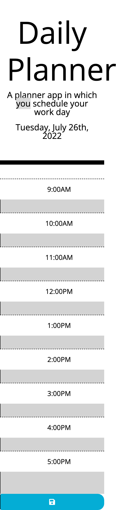

# work-planner

Using HTML, CSS, and Javascript files, I created a simple calendar application where the user can mark down events everyday. The user will be able to save events each hour in each and everyday, keeping track of their schedule to boost their time management. My application is also responsive to different devices and sizes.

# Submission
Deployed URL: https://bilalfarrukh2000.github.io/work-planner/
GitHub Repo URL: https://github.com/bilalfarrukh2000/work-planner

