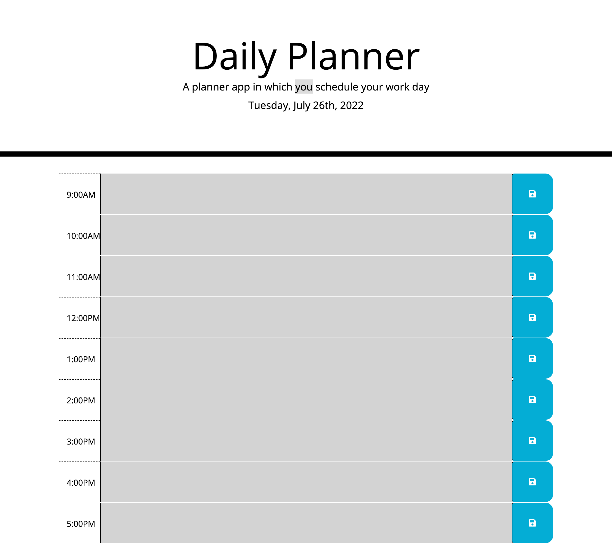

# work-planner

Using HTML and CSS files, I created a whole new website for my portfolio. I have linked my first project "Coding Refactoring" and have included placeholders for future projects.

I have written a description about myself and added a recent picture. I have added contact methods such as email and GitHub as well. My navigation bar links to corresponding sections of my website.

My website is also responsive to different devices and sizes.

# Submission
Deployed URL: https://bilalfarrukh2000.github.io/work-planner/
GitHub Repo URL: https://github.com/bilalfarrukh2000/work-planner

